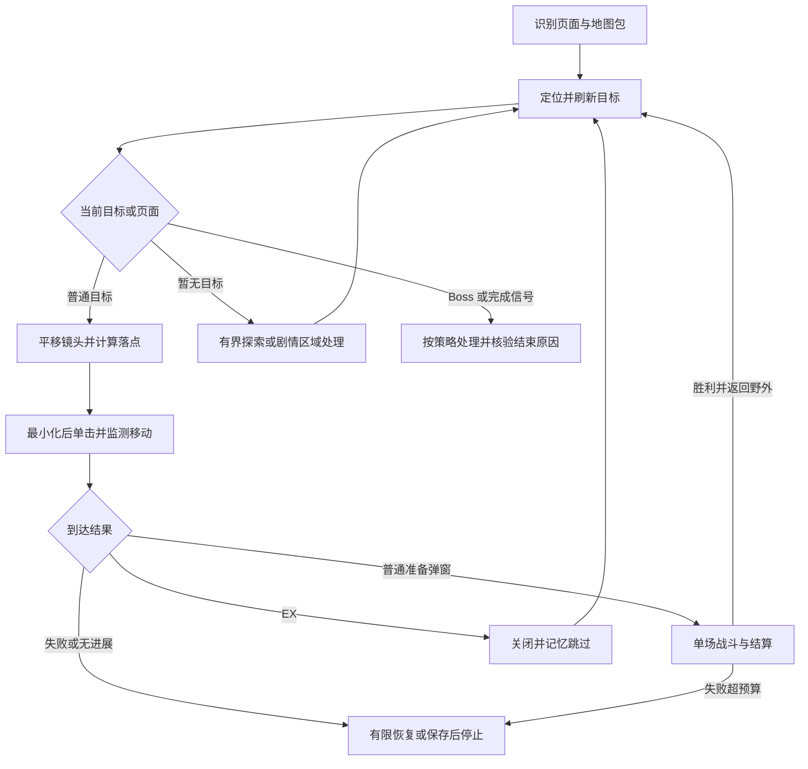

# 自动推图实现差距与后续计划

更新：2026-10-01（Asia/Hong_Kong）。独立实现位于 [module/campaign_prototype](../module/campaign_prototype/README.md)。M0 控制、失败契约与地图包校验已实现；M1 的远点镜头规划、完整目标点击、停稳与到达复核已有独立入口和管理界面调用。正式调度接入、跨区域机关及跨层导航仍需按后续阶段实施，不能将局部移动能力等同于整章自动推图完成。使用条件与验证步骤见[操作与验证说明](map-annotation.md)。下文保留分阶段计划与阶段记录。

## 目标与已确认约定

原目标是“定位自身与敌人 → 寻路与移动 → 普通战斗 → 战后刷新 → 直到 Boss / 章节完成弹窗”。依据聊天 `01a0e5bd-4d74-73e0-aac5-e56a689a6f09` 的 EX 跳过要求，以及后续 `01a0eb6f-28b2-7c11-a08d-1b5177e37ded`、`01a0ec86-23c5-75b3-9a5d-cb69253741b6` 的标注与导航要求，沿用以下约定：

- 普通关卡自动推进，EX 识别后忽略；Boss 到达与章节完成分别报告，不能把遇到 Boss、没有可见敌人或收集计数 `0/14` 当作通关。
- 可通行时先平移主场景镜头，让目标进入画面，再点击目标交给游戏自动寻路；小步纠偏只用于到达后的偏差或恢复，不要求沿规划路径逐点点击。
- 放大小地图后，返回场景使用**左上角最小化**，保留紧凑小地图。展开面板内拖动只改变小地图视野，不等于平移主场景。
- 当前支持基线为 Windows、中文、`1776×999` 客户区。其他语言、尺寸、Android 或后台／虚拟显示器运行需要独立验证，不能从本轮前台实测推断支持。
- Wiki 小队圆环中心按用户约定作为收集点坐标。收集点导航是移动能力验证；自动拾取、全收集不作为普通推图闭环的前置条件。
- 既定批量地图采集任务保留，但无需先采完 41→1 章才能验证一个章节的推图闭环。

## 当前能力盘点

| 能力 | 已有代码与证据 | 还差什么 |
| --- | --- | --- |
| 地图扫描、道路拼接、投影和裁剪 | [扫描器](../dev_tools/minimap_reconstruct.py)、[回归](../tests/test_minimap_reconstruct.py)；38 章修复并裁剪为 2048×1908 | 尚未验收整个相机域；`roads_exhausted` 不等于全图无遗漏 |
| 章节切换、地图包导出 | [章节采集器](../dev_tools/minimap_chapters.py) 已有 OCR、稳定检查、哈希与导出 | 当前是已开放章节的倒序采集，不是推图后的下一章解锁流程；已补逐章重试、失败归档与续跑，连续现场采集和质量目录仍待验收 |
| 标注编辑与保存 | [标注工具](../dev_tools/map_annotator.py)、[说明](map-annotation.md)；点／线／区域／连接、哈希绑定、备份、并发保护 | 标注连接尚未作为运行时任务和通行约束使用；运行时地图加载器未正式化 |
| 当前视野与小队定位 | [AdaptiveLocalizer](../module/campaign_prototype/adaptive.py) 已在 38 章多个视野配准；区分小队与视野中心 | 独立包加载与错误包校验已实现；跨章及动画漏检仍需现场验收 |
| 镜头平移与远距离到达 | [camera_to.py](../module/campaign_prototype/camera_to.py)、[run.py](../module/campaign_prototype/run.py)；10 号及随机 7→9→5→8 单击到达 | 操作由多个脚本和人工串联；准确落点还依赖 Wiki 场景匹配；未形成通用 `goto_world` |
| 可通行性与道路路径 | [Localizer.route](../module/campaign_prototype/probe.py) 有道路距离场、栅格 A*、斜向过角保护 | 不包含门、机关、区域解锁和动态障碍；未学习不可达边；不能仅凭静态路径证明游戏可达 |
| 普通敌人／EX 识别与接近 | [旧寻敌探针](../module/campaign_prototype/goto.py) 已触发普通 41-21 弹窗并实测排除 EX | 尚未与新定位器连接；EX 关闭后退出，没有持续目标表、去重、跳过记忆与探索调度 |
| 战斗按钮与游戏内置自动战斗 | [SemiCombat](../module/daemon/semi_combat.py) 已有进入战斗、快速战斗、自动射击／爆裂、结算和剧情处理 | 是独立挂机循环，没有向推图返回单场结果；新导航未接入。需复核模板、坐标和主线战斗页面 |
| 失败与战斗流程参考 | [EnemyEvent](../module/simulation_room/event.py)、[AutoTower](../module/daemon/auto_tower.py) 已处理失败／结束等分支 | 场景特有循环不能直接当作主线战斗控制器，需要复用动作和判据并实测适配 |
| 调度、页面进入与设备 | [main.py](../main.py) 已有任务、异常、重启机制；[页面图](../module/ui/page.py) 有战役选择页 | 没有基于新地图的自动推图入口、主线野外页面流程、状态存档与恢复；`page_surface` 是地表日常入口，不能当作本方案主线页 |

当前结论：**地图与导航原型已有现场证据，持续推图闭环尚未实现。** 下一步需要把已有定位、目标选择、战斗动作和恢复机制连接成有界流程。最近四个随机收集点的 4/4 到达证明有限样本下单击寻路可行，不代表无人值守推图成功率。

## 需要先解决的代码缺口

1. **采集与导航的最小化已统一，仍需现场集成验收。** [导航辅助函数](../module/campaign_prototype/goto.py) 已实测最小化；[章节采集器](../dev_tools/minimap_chapters.py) 和 [DriverWindow.reset_minimap](../dev_tools/minimap_reconstruct.py) 也已改为左上角最小化返回紧凑态，[相关测试](../tests/test_minimap_reconstruct.py) 已更新。批量恢复与验证边界见[工具说明](wiki-collectibles-batch.md)。复用 `SemiCombat` 时仍需复核其 `MAIN_STORY_MAP_CLOSE` 分支。
2. **通用场景落点没有完成。** [match_scene.py](../module/campaign_prototype/match_scene.py) 读取对应 Wiki 全场景截图，以固定参考锚点做 SIFT／RANSAC，再由人工看图传入 `--click`。已有 `A_INV` 和局部 Jacobian 是方向／近距离估计，尚不能替代远处目标的有效投影；小队出视野后也不能拿视野中心冒充小队脚下位置。
3. **到达与卡住判定还靠人工。** `run.py` 按指定秒数等待，最后定位；黄色收集提示由人工确认。需同时判断行走中、已停、目标触发、进入弹窗、无进展和超时，避免尚在自动寻路就追加点击。
4. **两套导航尚未合并。** 41 章旧探针的 `0.4` 是模板相关分数；38 章新定位器的 `0.85` 是道路 IoU，二者不能直接比较或互换。敌人必须用当前接受的单应矩阵转到同一地图坐标系，绑定本帧、章节与地图版本。
5. **地图加载已参数化，跨章能力仍待验证。** 独立 `MapPackage` 绑定章节、难度、文件哈希、投影、裁剪、覆盖和配准质量，旧标定已独立为受绑定文件；部分入口仍限定原 38 章目标编号。任意标注对象／连接不自动进入目标选择，不能由参数化加载推断其他章节可用。
6. **基础失败契约已补齐，持续流程尚待实现。** 镜头子进程失败向上层返回非零状态，回执写盘前释放驱动；STOP、取消、失焦、尺寸和窗口位置变化均阻止后续输入。镜头来源计划绑定地图、目标和时间，并在操作前复核当前视野。详细原理和限制见[运行文档](campaign-prototype-principles.md)。
7. **战斗不是可返回的单步。** `SemiCombat.run()` 是持续循环，且其[基类](../module/daemon/daemon_base.py) 会禁用设备卡死检测。需要提取有界单场战斗流程，恢复或替代相关保护，返回胜／负／超时／取消和当前页面；不能让导航与半自动战斗争抢截图、鼠标或小地图。
8. **地图与场景参照仍为本机数据。** 原型代码、必要模板和地图导入入口已位于可分发目录；采集与标注工具已在仓库内。大地图、原始截图、Wiki 场景图和运行回执仍受 [.gitignore](../.gitignore) 忽略，使用其他机器时需按[原型说明](../module/campaign_prototype/README.md)导入合格地图包。

## 实施顺序与验收

下面先形成一个章节的最小闭环，再扩展完成范围。每阶段完成后更新执行记录和证据；数量是后续拟定的验收门槛，不是已有测试结论。

### M0：收敛地图控制、运行环境和结果契约（独立原型范围已验收）

- 统一地图状态与最小化行为，覆盖导航、采集和将复用的战斗分支；明确原始客户区、设备截图和地图坐标三者的换算。现有资源坐标多为项目标准截图坐标，不能直接套到 `1776×999` 原始客户区。
- 修正原型中失败返回、写盘异常释放和停止信号；选择一个合格章节包，绑定章节、难度、图片哈希、投影、裁剪与覆盖／配准状态。
- 按本轮要求，定位、地图控制及相关实验已移至 `module/campaign_prototype/`，独立运行，复用已有虚拟鼠标底层。接入现有任务／设备生命周期与推图业务架构仍延后。
- **验收：** 紧凑↔展开连续 10 次均正确，返回只使用左上角最小化；中断、焦点丢失、错误尺寸、错误地图包和回执写盘失败均停止并释放鼠标。目标平台与截图坐标校验通过。
- **本轮结果：** 故障路径和模拟十次切换有离线回归；38 章真实保存帧定位回放通过。现场首次因焦点转移停止且释放正确，保持游戏前台后真实十次循环复测通过。已有战斗分支待正式接入时再统一，不纳入本轮独立原型验收。复现步骤见[操作与验证说明](map-annotation.md)。

### M1：完成不依赖 Wiki 场景图的 `goto_world`

- 输入当前地图目标坐标，自动定位、平移镜头、计算有效地面落点、最小化、单击并等待。优先验证现有投影与现场标定组合；若不足，用同帧地面对应关系标定，不先引入无证据的大型视觉模型。
- 小队出视野时单独保留小队最后观测与相机位置；目标必须位于可用投影域和场景可点击区域。不允许把远离视野的单应外推值当作可靠点击。
- 加入有界重新定位、到达／无进展／超时判定、必要的末段微调；静态道路只辅助可通行性和恢复，常规移动仍交给游戏自动寻路。
- **验收：** 在 38 章固定种子选取至少 10 段可达目标组合，包含未用 Wiki 全场景截图参与计算的道路点、近距离、远距离、绕行及镜头离开小队的情况；过程中无需人工提供点击坐标。另覆盖至少 3 种不可达／定位失败／视野受限情形，正确退出或有限恢复。收集点用自动提示检测核验，普通地面点用移动停止与重新定位核验；像素距离仅作诊断。

### M2：统一动态敌人目标与 EX 跳过

- 把现有普通／EX 标记识别接入新定位器，建立章节内目标表：类型、最后观测、置信度、位置、尝试次数、完成／跳过状态。分清同一敌人的多视野观测与相邻的不同敌人。
- 普通目标优先；误到 EX 时确认弹窗、关闭、记忆该目标并继续其他候选。没有可见普通敌人时有界扫描道路前沿，刷新任务／剧情／区域状态；不直接宣布完成。
- **验收：** 在仍有活怪的已确认章节，连续选择至少 3 个普通目标到准备弹窗，EX 既有地图级过滤也有弹窗兜底；关闭 EX 后无需重启脚本即可换目标，不重复撞同一 EX。战斗未接入前用明确的测试终止点结束本阶段。

### M3：接入一场战斗并回到地图

- 复用 `SemiCombat` 的按钮、自动射击／爆裂和剧情动作，提取有界单场流程。识别普通准备、快速战斗、战斗中、胜利、失败、结算、加载和返回野外。
- 完成战斗后使旧小队位置、相机变换和可见敌人列表失效，再截图定位；只凭弹窗关闭不能把敌人标为已击败。
- 快速战斗、剧情跳过沿用用户配置；失败达到次数／时间预算后停止并报告，不无限重复进场，也不自行改队伍或消耗道具。
- **验收：** 至少 1 次普通战斗完整胜利并返回已确认的主线野外页；验证实际可用的快速战斗分支；失败、超时、取消用现场或真实回放覆盖。单场结果可供上层消费，导航与战斗不存在并行控制。

### M4：单章持续推图与恢复

- 串联“观察 → 选目标 → 导航 → 战斗 → 重新观察”，处理战后分批出怪、剧情挡路、区域切换、门／机关等实际阻碍；没有证据的场景动作先停止记录，不对所有亮点盲点。
- 对无进展记录目标／边失败，尝试其他目标或有限重定位；持久化章节、地图版本、已完成／跳过目标、失败预算和上次状态。重启后必须重新识别现场，不复用旧点击计划。
- **验收：** 同一未清空章节连续完成至少 5 场普通关卡，覆盖一次战后目标变化及一次中断后恢复；途中不依赖人工选目标、给坐标或重启每步脚本。遇到 Boss 能明确报告 `boss_reached`，遇异常能带原因结束。

### M5：Boss、章节完成与任务入口

- 按原目标，先把到达 Boss / 章节结束弹窗作为单章阶段终点；**`boss_reached` 不能上报为 `chapter_complete`**。若要宣称完整章节通关，必须进一步验证 Boss 战斗与真实章节完成／解锁信号。
- 接入 `main.py`、现有配置生成和任务元数据、主线页面进入流程；配置地图包、目标章节／范围、Boss 终止策略、失败预算、剧情／快速战斗偏好。前端复用现有设置与运行状态，不另建地图编辑器。
- **验收：** 从任务入口启动，无人工导航地完成约定的单章范围并报告准确结束原因；真正打通一章时留存完成证据。停止和恢复可以由现有任务机制控制。若加入自动跨章，另验证解锁后切到下一章、加载正确地图包并重新定位。

下一阶段攻克 **M1 通用落点与到达判定**。M2 的识别回放和 M3 的战斗动作提取可分开开发，但现场游戏控制必须串行。当前独立实验不等于无人值守循环。

## 状态与模块边界

建议运行流程如下；这是待实现状态机，不是当前代码的调用关系：

- **地图观测：** 章节／难度、地图哈希、截图时间／序号、ROI 到地图变换、道路评分、可选小队坐标、相机中心、可见目标。缺小队标记时输出缺失，不能伪造小队位置。
- **导航结果：** `arrived`、`battle_ready`、`ex_skipped`、`unreachable`、`localization_failed`、`timeout`、`cancelled` 等明确结果，附最后观测与证据。图像匹配通过只代表定位通过，不代表目标已到达。
- **战斗结果：** `won`、`lost`、`timeout`、`cancelled`，附关卡身份和当前页面。主循环决定是否重试、刷新、退出；战斗模块不自行启动另一个无限导航循环。
- **设备操作：** 由同一设备实例串行管理捕获、坐标换算、点击和释放；复用已有日志、异常、停止和重启基础设施。地图加载／配准不携带点击副作用。

## 保留的独立工作线

| 工作线 | 当前缺口 | 与推图闭环的关系 |
| --- | --- | --- |
| 批量地图与质量目录 | 已有 34～41 章的若干批次，不能视为完整覆盖；`manual_live` 的 39／40 章仍标记 `insufficient_joint_evidence`，已有 38／41 章包的完整相机域标志也是 false | 保留原批量采集任务；先修复／验收下一测试章节。加载器拒绝失败配准包，部分覆盖包明确范围，不阻塞在合格区域验证单章 |
| 自动收集 | 38 章 14 个点已标注，已验证其中 6 个不同位置的到达；提示检测、实际拾取、成功确认／去重未实现 | 在 M1 之后作为可选目标类型，不能用收集数判断主线完成 |
| 多语言、分辨率与后台环境 | 现有实测主要为中文前台 1776×999；旧战斗资源与设备截图存在另一套坐标约定 | 首版声明支持范围；逐项补模板、坐标和设备验证，不因为有虚拟显示器代码就宣称新导航已支持后台 |
| 地图与测试资源分发 | 正式运行依赖的数据当前在被忽略目录；完整截图／Wiki 图不适合整包提交 | 发布最小运行地图、必要资源和脱敏回放样本，提供地图包导入方式；不把个人配置与账号数据纳入 |

## 后续验证与记录

按 [AGENTS.md](../AGENTS.md) 的唯一验证清单执行：Python 改动做语法和相关路径运行验证；新增关键状态／恢复逻辑用真实回放或必要回归覆盖；只有修改 SPA 或桌面构建输入时才执行对应构建。文档更新只核对内容、链接和 `git diff --check`。

每次实测记录地图哈希、起终点、相机拖动与移动点击次数、定位质量、目标类别、战斗结果、失败／停止原因和最新现场。原始图留证据目录；更新执行记录顶部与历史条目，避免旧“当前状态”继续误导接手。本轮的验证与限制已更新到执行记录。
