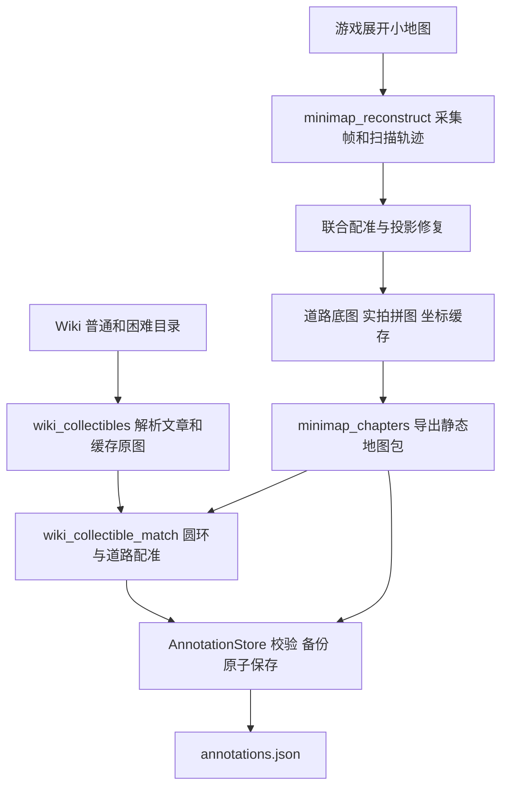

# 地图采集、重建与 Wiki 标注原理

本文说明从游戏小地图到静态地图、再到收集点标注的数据处理链。入口与恢复命令见 [Wiki 批量工具说明](wiki-collectibles-batch.md)，人工编辑见[标注工具说明](map-annotation.md)，消费地图的导航原型见[运行原理](campaign-prototype-principles.md)。

## 1. 数据分层与脚本职责

| 脚本 | 负责的工作 | 不负责的工作 |
| --- | --- | --- |
| `dev_tools/minimap_reconstruct.py` | 单章地图采集、跟踪、拼接和诊断 | 战斗、章节解锁、收集物拾取 |
| `dev_tools/minimap_chapters.py` | OCR 确认章节、倒序切章、导出与批次恢复 | 完成主线后自动解锁下一章 |
| `dev_tools/wiki_collectibles.py` | 目录／文章解析、缓存、逐项配准调度和标注合并 | 游戏控制 |
| `dev_tools/wiki_collectible_match.py` | 将 Wiki 小队圆环投影到本地图 | 证明游戏内已拾取 |
| `dev_tools/map_annotator.py` | 地图与标注校验、版本冲突、备份和保存 API | 自动理解点／线／区域的推图业务含义 |

这些脚本及原型中的每个 Python 方法、内部辅助函数都有中文 docstring。复杂算法的原有英文说明一并保留；中文说明解释输入所处坐标、拒绝条件或非显然的用途。

## 2. 为什么先校正透视再拼接

地图的网格在屏幕上是透视平面，同一道路在不同视野位置会变形。直接把原始截图平移叠起来，即使一个角落对齐，其他部分仍可能重影。

`grid_horizon` 排除道路与控件后，从 Hough 线段提取两组网格方向，鲁棒拟合各自消失点。`MetricGrid` 由两方向的几何关系恢复度量平面；暗地图缺少长线时，`_vanishing_from_dots` 使用稀疏网格点的近邻方向拟合线束。

随后对校正网格的横纵投影做自相关，估计格距，再规范到配置的 `cell_px`（默认 48）。由此得到 ROI 到俯视地图平面的 `matrix`、变换画布 `warp_size` 和去边框后的 `valid`。

俯视比例和显示朝向是两件事。默认 `screen_oblique` 使用局部 Jacobian 的正交部分恢复游戏斜向朝向，只旋转／反射，不重新加入透视剪切或非等比缩放。不能为了“看起来像原截图”而破坏地图距离比例。

旧 `Projection` 和 `Scanner` 保留兼容历史 `version=1` 扫描；当前连续拖动采集使用 `MetricGrid`、`FlowTracker` 与 `DriftScanner`，输出 `version=2`。

## 3. 连续拖动与高频里程计

`DriverWindow` 首先确认目标客户区、DPI 和前台状态。单次 `DriftScanner.stroke` 让输入线程持有虚拟鼠标锁，执行按下、连续拖动和抬起；主线程同时采集地图 ROI。拖动端点在面板内部，默认探索行程 120px，最初两次运动标定各为 240px；速度和采样参数由命令行控制。

`FlowTracker` 从稳定背景提取角点，计算前向与后向 LK 光流。它排除道路、点击闪光、边框和计数器，要求至少 24 个可靠内点；往返误差、跟踪误差、内点比例与位移离散度都通过后，才把角点投影到地图平面并取中位位移。

设光流测得内容位移为 `delta`，相机位姿更新为 `position -= delta`。图像内容随拖动移动，相机观察位置方向相反，符号不可混用。采样同时读取真实驱动鼠标位置，以识别采样间隙和手势停滞；累积到关键帧距离后保存 PNG 与位姿。

两次正交拖动用于标定 `cursor_map`，即鼠标位移到相机地图位移的二维映射。要求有足够稳定移动样本、非退化行列式和合理条件数。触边时无法得到完整移动，不能把触边标定当作可靠映射。

若采样断档且位移不可靠，保存 `tracking_before.png`、`tracking_failed.png`、`tracking_failure.json` 后失败退出。不能把光流丢失、帧预算耗尽或没有道路解释为“已到地图边界”。

## 4. 前沿探索与覆盖结论

`frontier_sides` 在校正平面的四个网格轴边缘检查道路。只有视野边缘仍有道路才生成前沿目标；新目标按距离与已访问点去重。`DriftScanner` 优先选择最近前沿，通过 `cursor_map` 计算拖动方向，进行有限次数的闭环移动。

多次在要求方向上没有进展可以记录相机限位；没有道路的区域记录为道路边缘；无法解释的未到达目标放入 `unresolved_frontiers`。`stationary_tail`、`stationary_stroke` 分别要求尾段或整段中鼠标仍有足够行程而背景接近静止，避免把无输入或亚像素闪烁误当运动证据。

`roads_exhausted` 表示当前策略下道路前沿已遍历；它不证明所有相机区域被扫描，也不证明地图中不存在遮挡道路、剧情解锁区域或动态障碍。完整覆盖标志 `whole_camera_domain_verified` 必须单独读取，不能由“扫描退出成功”推导出来。

## 5. 离线联合配准

背景网格与道路可能处于不同渲染层，二者随相机移动的幅度不一定相等。背景光流适合连续跟踪和预测，但直接用作最终道路拼接坐标会累积偏差。

`JointRegistration.features` 分离道路、背景网格和有效区域；`correlate` 用 FFT 生成整个平移域的道路 IoU、网格相似度及重叠面积。道路轮廓能区分不同位置，网格存在整格周期歧义，因此先用独特道路约束标定网格位移到道路位移的 `motion_map`。

拟合至少需要 12 对样本，并检查方向激励、内点比例、尺度范围。`measure_roads` 要求道路 IoU 至少 0.90、独立候选分差至少 0.06；证据不足时不降低门槛强行出图。

相邻帧与重访帧构成约束图。对于约束 `(a,b,delta)`，要求 `position[a] - position[b] ≈ delta`；`solve_joint_positions` 同时保留弱里程计链，固定基准帧，分别求解横纵坐标，并降低离群约束的权重。先用网格和道路求粗略位置，再根据该位置搜索有重叠的非相邻帧，以道路 IoU ≥0.90、独立候选分差 ≥0.06 的直接道路匹配替换粗略重访边，限制弱里程计连接的局部漂移。

`refine_map_positions` 报告有效样本、相邻／重访约束数量和残差。状态为 `insufficient_joint_evidence` 时输出可诊断的里程计预览，静态导出器拒绝该失败结果。低残差表示约束内部一致，不是独立测量的绝对位置误差。

## 6. 初始投影错误时如何恢复

透视标定有偏差时，同一道路经过校正后仍随位置变形，增加平移约束无法解决。`recover_map_projection` 在每次联合配准后复核投影，包括状态已经通过的结果。它从分散保存帧提出新投影，并用相同的 12 对移动帧比较道路重叠；少量约束的低残差不能替代此项检查。

候选道路 IoU 中位数须至少 0.90，且比原投影改善至少 0.04，最后还必须重新通过完整联合配准。`reproject_scan` 转换的仅是里程计初值，最终帧位置仍重新求解；不修改原始 `scan.json`。新的底图、投影、帧位置和标注坐标必须一起导出。

报告保留原失败原因、新标定来源和初值变换。原扫描中的限位与前沿证据仍处于旧扫描坐标，输出明确注明，不能把它们直接叠在新底图上。

## 7. 拼接、裁剪与地图包

道路融合先从道路掩码中去除与覆盖掩码相同的边框、右下角控件区域，再累计各帧道路和有效覆盖，求 `terrain_probability = road_sum / coverage_sum`。否则被排除控件仍会进入道路分子，在覆盖为零处形成悬空碎片。实拍拼图按距有效域边缘的距离选取更靠近帧中央的像素，减少透视边缘误差；它与清理后的道路底图共用坐标但内容不同。

裁剪取 `terrain_probability > 0.15` 的所有像素外接框，四周默认保留一格。包括弱接缝和分离道路，不只取最大连通块；没有道路时保留完整诊断画布。所有图片和数组使用同一 `[left,top,right,bottom)`，不得各裁各的。

未裁剪时，帧中 ROI 点 `p` 的拼图坐标为：

`map_point = project(projection, p) + positions[frame_index] - origin`

裁剪后将 `origin` 加上裁剪左上偏移，标记坐标减去该偏移，帧位置与投影不变。这样同一个公式继续成立。朝向变换已组合进导出的投影与帧位置，不要再重复应用 `scan_to_map`。

| 文件 | 数据含义 |
| --- | --- |
| `source/scan.json` 与 `frame_*.png` | 原始采集记录、位姿初值和实际画面，离线重建的来源 |
| `source/registration.json` | 配准约束、质量、失败或投影恢复原因 |
| `source/map_data.npz` | 道路概率、覆盖、最终帧位置、原点、投影、画布和朝向 |
| `source/summary.json` | 覆盖／配准状态、画布、裁剪与帧计数 |
| `map.png`、`reference.png` | 同坐标的道路底图与实拍拼图 |
| `map.json` | 章节、底图哈希、尺寸、坐标约定、变换与采集摘要 |
| `annotations.json` | 绑定底图哈希的点／线／区域／连接及来源信息 |

静态导出保留已有地图和标注，拒绝覆盖。原型需要额外的 `calibration.json` 与 `validation.json`，由[独立包导入器](../module/campaign_prototype/prepare_package.py)生成并核验。

## 8. 章节批量采集与恢复

`minimap_chapters` 处理已经开放的普通章节，按 `start` 到 `end` 倒序。章节号从固定客户区区域 OCR，置信度需 ≥0.95；还要求紧凑地图可见、道路连续稳定，至少等待八秒，避免加载动画被误当作可采集页面。

每章记录尝试次数、阶段和错误。已完成扫描但尚未导出的目录可以直接离线重建；失败扫描移动到本章 `attempts/<时间戳>/` 后再重新采集。已有地图或标注不会为了重试被覆盖。

单章失败可继续后续章，但切章后的身份未确认时整个批次暂停，退出码 `2` 并记录 `resume_start`；普通采集失败为 `1`，STOP 或中断为 `130`。每次进度更新使用临时文件替换。采集失败先尝试保存原因，任何保存失败都不应阻止驱动释放。

## 9. Wiki 目录、文章与缓存

`wiki_collectibles` 从 GameKee 目录中分别读取“地图收集（主线）”和“地图收集（困难）”，以 `(chapter,difficulty)` 为唯一键。普通／困难共用同章底图，但各自保留文章、编号、名称和坐标，不能把普通点直接当困难点。

文章结构兼容新版 JSON 树表格、旧 HTML 表格、有／无表头和早期“标题 + 图片”分组。优先取原图地址而不是占位图；区域图、地图图及未分类图保留角色。编号缺失或重复、布局无法理解时保留错误，避免静默错序。

缓存按 `chapter_NN/normal|hard/` 隔离，保存 `detail.json`、`article.json`、`items.json`、图片和配准结果。下载先验证内容能解码为图片或有效 API JSON，再将 `.part` 原子替换为缓存文件；离线模式缺缓存直接失败，不联网。

匹配缓存键包含原图内容哈希、底图哈希、地图 NPZ 哈希和 `MATCH_VERSION`。地图变换或算法版本改变会导致重算，而不是复用旧坐标。批次 `progress.json` 区分完整、待复核、缺地图、缺文章和失败。

## 10. 用小队圆环定位 Wiki 收集点

按已确认约定，Wiki 截图中小队圆环中心作为物品地图位置。它表达攻略作者站位，不是对场景物品图标的直接测量。

`minimap_masks` 只接受近似 16:9 横屏布局，归一化到 `1920×1080` 后提取紧凑地图 ROI `(25,96,243,307)`。细网格用形态学开运算去除，道路细缝用闭运算补足；控件、亮标记、边框及小队圆环从有效域排除。

`player_center` 在预期圆环区取白色像素，随机抽取三点拟合圆。候选必须有合理中心、半径，并覆盖足够多角度区间，防止把单段弧或文字当圆。最佳内点再用最小二乘迭代细化；检测失败不会退回固定图片中心。

`MapMatcher` 在四分之一分辨率搜索尺度、透视与全图平移，再对前八个候选在全分辨率附近细化。每个候选都得到 ROI 到地图的单应矩阵 `H`，收集点为 `project(H, player_center)`。

接受条件同时满足：

- 道路 IoU ≥ 0.85。
- 最佳粗候选与距离超过 130 地图像素的竞争候选分差 ≥ 0.10。
- 接近最佳分数的参数候选，其位置分散不超过 20px。
- 坐标处于本地图边界内。

同一件物品的多张图片若各自通过但坐标相差超过 20px，整项仍降为 `needs_review`。平直道路、重复路口、图标遮挡和不支持布局都可能导致拒绝；不通过的候选保存叠加预览和原因，不自动写入新位置。

## 11. 标注保存与人工编辑

导入 ID 采用 `wiki_<文章ID>_<编号>`。`save_annotations` 默认保留同来源已有坐标，包括人工修改；只有显式 `--update-existing` 才替换同来源点。普通／困难保留独立来源难度及不同颜色。同 ID 却指向另一来源时拒绝合并。

`AnnotationStore` 校验底图哈希、真实尺寸、原图坐标约定、有限且不越界的顶点、唯一 ID 和连接端点。保存请求必须携带加载时原始标注字节的哈希 `revision`，磁盘已变化则返回冲突，不能覆盖另一个窗口的修改。

保存顺序是：校验 → 比较版本 → 备份旧标注 → 同目录临时文件写入并刷新 → 原子替换。HTTP 服务仅监听本机，保存使用当前会话令牌。进程内锁与版本检查防止同一服务中的并发覆盖；它不是跨多个独立服务实例的数据库事务，避免多服务同时写同一个包。

点、折线、多边形和连接只是几何标注。导航原型目前只读取来源难度匹配的收集点，不会把任意连线自动解释为可通行道路或任务顺序。

## 12. 质量指标的含义

历史 38 章道路修复、普通 14 点和困难 6 点属于各自记录的样本。新一轮批量匹配可能因门槛拒绝部分已人工确认的普通点，这时保留旧坐标并记录待复核，不能为了凑齐数量降低门槛。

配准 IoU 衡量道路形状重合，残差衡量约束内部一致性；都不等同于游戏绝对位置真值。扫描完成、配准通过、标注保存、游戏内到达、实际拾取和章节通关是不同验收结果，应分别记录。最新测试及现场限制以[执行记录](minimap-autopush-execution.md)为准。
