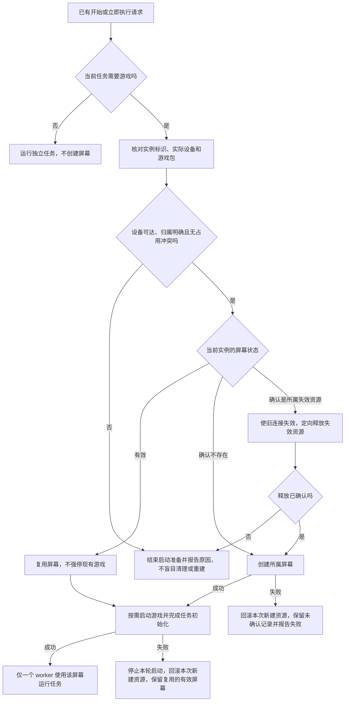
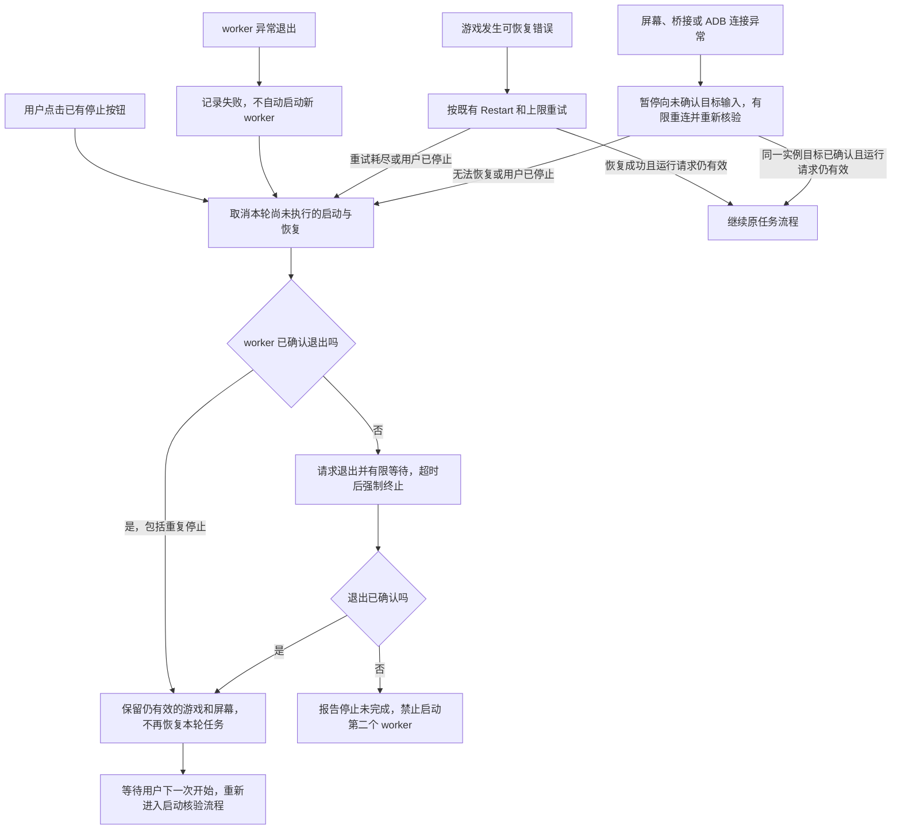
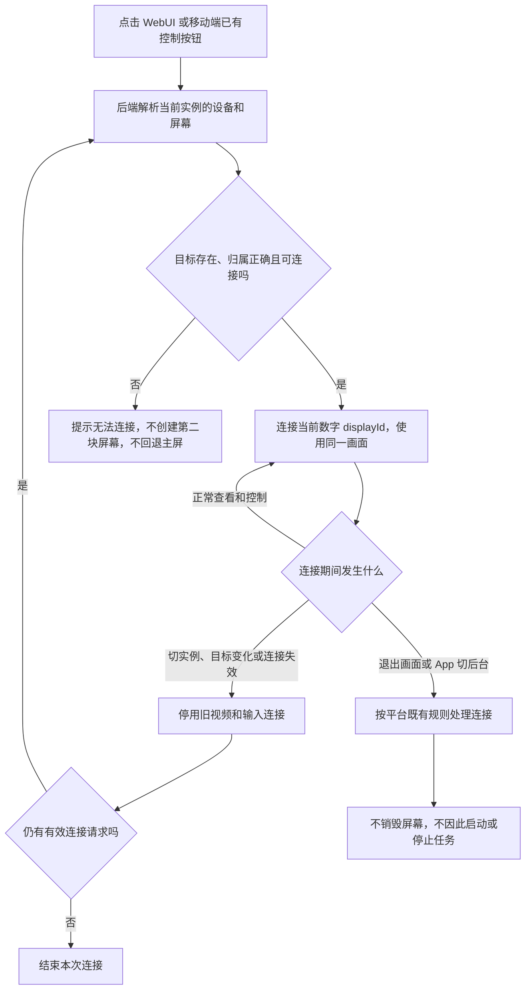
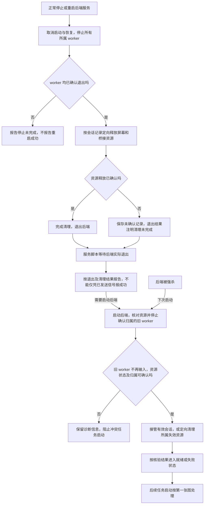

# 真机虚拟屏幕生命周期与恢复计划

状态：2026-09-26 自动生命周期和现有控制入口的同屏连接已在两个工作区实现，代码尚未提交。下文保留行为约定与验收标准；实际通过及未执行的验证见文末。新增管理入口仍不在本轮范围。

适用范围：PC 通过 ADB 控制 Android 真机，以及 Android App + Termux 自部署 NKAS。PC 原生游戏的 Windows 虚拟显示器不在本计划内。

## 本轮范围

- WebUI 和移动端已经有控制按钮，继续复用，不新增“手动接管”按钮，不另造一套查看和控制流程。
- 优先梳理使用已有开始、停止、立即执行、控制和服务启停入口时，屏幕的自动创建、复用、目标确认、恢复与清理。
- 不预设点击现有控制按钮就自动停止任务，也不新增控制授权、租约或多客户端接管流程；现有交互语义如需改变，另行讨论。
- 新的“虚拟屏幕”管理面板、状态卡、独立启动屏幕、重启游戏、重建、关闭、清理等手动操作均为待定，不作为自动部分的交付前提。
- 设备层仍须具备创建、核验和定向释放能力，供自动流程使用；底层能力不等于必须立即增加对应按钮或公开管理 API。

## 自动部分完成后的实际效果

| 使用现有功能时的场景 | 目标效果 |
| --- | --- |
| 首次配置真机虚拟屏模式 | 自动生成稳定屏名；无需手填数字 displayId；保存、读取和实例改名不会改变标识 |
| 点击“开始”或“立即执行” | 任务需要游戏时自动准备屏幕；有效则复用，不存在则创建；无需先进入管理页建屏 |
| 停止后再次开始 | 优先复用保留的屏幕和游戏，不因新建 worker 无条件重建屏幕或强停游戏；仍执行任务必要的页面与登录检查 |
| 使用 WebUI 或移动端已有控制按钮 | 自动连接当前实例的同一块屏幕；WebUI 不默认控制主屏，移动端不另建第二块 NKAS 屏幕；不增加按钮 |
| 点击已有“停止” | 后端独立停止 worker 并确认退出，取消尚未完成的本轮启动与恢复；保留仍有效的游戏和屏幕 |
| worker 卡死或已经退出后再点停止 | 有限等待与强停兜底；重复停止返回实际结果，不因已退出而报 409；不能假报停止成功 |
| 游戏发生可恢复错误 | 复用既有 Restart、登录重试和上限；用户停止后不再执行后续恢复；耗尽重试后保留有效现场并报告失败 |
| worker 异常退出 | 保留仍有效的屏幕和日志，不无限自动启动新 worker；下次用户开始时重新核验资源 |
| 屏幕或桥接在运行中失效 | 有限重连并核对归属；无法恢复则停止并报告原因，不回退主屏；下次有效启动请求自动处理可确认归属的失效资源 |
| 退出画面页、关闭浏览器、移动端切后台 | 查看连接沿用平台生命周期，任务和屏幕不因退出查看而销毁；已停止的任务也不会因此重新运行 |
| ADB 断连、无线调试端口改变、手机重启 | 不复用过期数字 ID，不把连接失败当作已清理；重连后先核实设备及屏幕，控制失败时不切主屏 |
| 正常停止或重启后端服务 | 先停止所管理的 worker，再定向释放所属屏幕和连接；Android 服务脚本等待实际退出后再报告成功或启动新服务 |
| 后端被强杀后重新启动 | 先核对旧 worker 与设备资源，确认归属后接管或定向清理，防止新旧任务并行 |

“保留现场”仅指仍有效的资源和实际画面，不是游戏存档恢复。游戏已经崩溃或手机已经重启时，下一次开始可能需要重新启动游戏。任务重新运行不保证从中断的代码位置续跑。

## 屏幕名称与两类标识

保留已有方向：名称固定，Android 数字 displayId 动态获取。配置里的 `VirtualDisplayId` 是用于生成名称的实例标识，不是 Android 数字 ID；不需要为了稳定名称去固定数字 ID。

| 概念 | 示例 | 来源与保存规则 |
| --- | --- | --- |
| 实例的稳定屏幕标识 | `abc123def456` | NKAS 首次生成并保存到 `Emulator.PhysicalDevice.VirtualDisplayId`；复制实例重新生成 |
| Android 屏幕名称 | `NIKKE-abc123def456` | 由固定前缀和稳定标识推导；同一实例重建屏幕后名称不变 |
| Android 数字 displayId | `19`，重建后可能为 `23` | Android 在创建屏幕时分配；只保存到运行状态，连接时重新核验，用于投屏和输入 |

名称是查找与核验线索，不是 Android 保证唯一的资源主键。相同名字可能对应多个残留屏幕；不同设备也可能拥有相同数字 ID。必须同时核对实际设备、稳定标识、所属屏幕服务及当前会话，不能取第一个同名屏幕或只凭数字 ID 接管、清理。

| 事件 | 名称和标识 | 数字 displayId |
| --- | --- | --- |
| 保存配置、实例改名、停止再运行 worker | 保持不变 | 复用同一有效屏幕时不变，重新核验后使用 |
| 重启游戏但保留屏幕 | 保持不变 | 不因重启游戏而主动改变 |
| ADB 重连或无线调试端口变化 | 保持不变 | 不假定变化，也不盲信旧值；确认是同一设备和屏幕后再使用 |
| 屏幕重建或手机重启后重新创建 | 保持不变 | 重新获取系统分配值；即使数值碰巧相同，也不能沿用旧会话连接 |
| 复制实例 | 新实例生成独立标识和名称 | 在新实例实际创建屏幕后获取，不能复制运行状态 |

具体实现约束：

- 保留现有配置键以兼容旧配置，文档和内部变量明确区分 `identity` 与 `display_id`；不把命名消歧变成无关的配置迁移。
- 稳定标识缺失时由配置层生成并持久化；受管理实例不能在设备端静默退回随机名称。合法旧标识应迁移保留，无效值应在启动屏幕前处理。
- 首次生成必须覆盖读取、生成和保存的完整并发窗口；只有文件读写各自加锁不足以避免同一实例得到两个标识。
- READY/INFO 或等效核验路径须能同时验证当前数字 ID 与所属身份；只收到 `id=19` 不能证明连到正确实例。会话更新后使旧视频与输入连接失效。
- 区分“未启用虚拟屏”与“已启用但目标未就绪”。后者禁止截图、输入和应用启动退回主屏；旧 ID 失效时先停用输入再核验。
- 正常使用期间无需每次截图重新查询 ID；在首次连接、连接恢复、服务变化和重建等边界核验。仅在启动期获取一次不能覆盖后续恢复。

实现使用正确配置路径，迁移合法旧标识，复制和导入重新生成标识；首次读改写整体加锁。受管理的设备端启动拒绝无效标识，READY/INFO 返回身份及 socket，虚拟目标无法确认时禁止主屏回退。

## 生命周期规则

| 对象 | 管理者 | 生命周期 |
| --- | --- | --- |
| 后端服务 | PC 启动入口或 Android 服务脚本 | 管理 worker 和屏幕会话；正常退出时清理自己管理的资源 |
| 实例屏幕会话 | 后端的设备层管理逻辑 | 独立于 worker 和查看页面；保存实际设备与资源归属，支持后续复用和定向释放 |
| 游戏 | 位于实例屏幕内 | 停止任务不主动关闭；既有重启任务、等待策略和屏幕释放可能改变游戏状态 |
| worker | 后端进程管理器 | 只连接和使用会话；正常退出、异常退出或强停不直接销毁后端拥有的会话 |
| 查看和控制连接 | WebUI、移动端现有功能 | 自动选择已核实的当前屏幕；退出连接不销毁屏幕，目标失效后不得继续向旧屏或主屏输入 |

- 同一实例最多运行一个 worker；开始、停止和自动恢复必须协调，避免重复启动和迟到的恢复覆盖用户停止。
- 任务调度的“等待中”不同于用户停止。继续尊重“等待时关闭游戏”等现有配置，但不因此销毁后端管理的屏幕。
- 同一实际设备、同一游戏包不得被多个实例并发自动化。遇到其他实例的屏幕会话占用时，先核验并明确报告冲突，不擅自 force-stop 游戏或移动其他实例的任务；具体手动处置入口待定。
- 保存 Serial、游戏包或虚拟屏开关的新值，不改变既有会话的资源归属。旧会话按旧记录管理，下一次启动按新配置完成必要核验和旧资源处理。
- 不新增后端启动后自动运行任务的策略；已有明确配置的自动启动必须在旧 worker 和资源核对完成后执行。
- CLI `main.py` 无 WebUI 后端管理者时，保留明确的独立拥有者和退出释放路径。

## 自动生命周期流程图

以下是实现遵循的生命周期约定；实测覆盖范围见文末。任务进程（worker）与后端服务分别处理：停止任务保留有效屏幕，正常退出后端才释放所属屏幕。两端继续使用已有控制按钮，新增管理入口不在这些流程内。

### 开始、立即执行与屏幕复用

查询失败不等于屏幕不存在。每次创建、启动游戏和启动 worker 前都检查本轮请求是否仍有效；用户停止后转入下方停止流程，禁止迟到的准备结果重新启动任务。已有 worker 时复用现有任务入口语义，不启动第二个 worker。

### 停止、任务异常与连接恢复

停止本地 worker 不依赖设备可达。设备失联时保留资源记录并标为待核验，不能断言屏幕仍有效或已经释放。上述恢复必须遵守用户停止优先；截图停更本身不触发“worker 卡死”的判断。

### 两端现有控制按钮与页面退出

此图不增加手动接管按钮，不预设现有控制按钮新增“自动停止任务”行为。控制连接的存在不要求 worker 存活；连接请求也不能替代任务启动请求来创建屏幕或启动游戏。

### 后端正常退出、重启与被强杀后的恢复

正常重启先完成旧后端实际退出，再启动新后端。若清理存在未确认结果，新后端必须重新核验，不能绕过冲突继续执行任务；未核验完成不执行已有自动启动策略。后端启动本身不要求立即新建屏幕。

### 配置与调度边界

| 情况 | 屏幕处理 |
| --- | --- |
| 等待下次任务，配置为停留原处 | 保留屏幕与游戏，worker 按原调度等待 |
| 等待下次任务，配置为关闭游戏 | 关闭游戏但保留屏幕，到期按原任务逻辑启动游戏 |
| 运行中修改 Serial、游戏包或虚拟屏开关 | 当前资源继续按原会话记录管理，下次启动核验新目标；清理不读取新 Serial 去误删 |
| 复制实例 | 生成独立稳定 ID；启动时仍检查实际设备和游戏包占用 |
| 实例改名 | 保留稳定 ID 和已有会话归属 |
| 删除实例 | 先停止并处理所属资源；释放未确认时保留可追踪记录 |
| 手机重启后再次开始 | 不沿用旧数字 ID，重新确认设备与屏幕；确认为不存在后才创建 |

## 实现位置

| 职责 | 实现 |
| --- | --- |
| 稳定 ID 迁移、并发生成、复制隔离 | `module/config/config_updater.py`、`routes_instances.py` |
| 后端持有、资源核验、创建回滚、恢复与释放 | `module/device/adb/virtual_display.py`、`virtual_display_session.py` |
| worker 取消、有限等待与停止确认 | `module/webui/process_manager.py` |
| 目标解析与现有 WebUI 控制 | `module/webui/api/routes_preview.py`、`webui/src/components/ScreenPreview.vue` |
| 退出先停任务再释放屏幕 | `module/webui/app.py`、`module/webui/updater.py` |
| Termux 内服务退出核验 | `scripts/stop_service.py`、移动端 `nkas-service.sh` |
| 移动端目标解析与原生核验 | Flutter `virtual_display_target.dart`、`screen_page.dart`，Android `ManagedDisplayTarget.kt` 与 iOS 原生会话 |

## 实施顺序与验收

### 1. 修正稳定标识与配置迁移

- 统一使用 `Emulator.PhysicalDevice.VirtualDisplayId`，迁移旧路径；正确路径已有合法 ID 时优先保留，避免升级改名。
- 新建和复制实例生成独立 ID；读取、保存、改名保留原 ID。
- 并发首次读取时只持久化一个 ID；使用真实配置结构验证，不能继续沿用错位的测试数据。
- 区分稳定标识与数字 displayId，按上方事件表处理；受管理路径禁止用随机名称掩盖标识缺失。
- 数字 displayId、PID、socket、forward 属于运行状态，不写入永久配置。

验收：首次配置可见 ID；重启、保存、改名不变；复制不同名；旧配置迁移和不同进程绑定顺序结果一致。

### 2. 后端拥有屏幕会话

- 在设备层集中创建、核验、连接和定向释放逻辑；后端持有实例会话，worker 只使用。
- 会话记录包含实际设备、稳定标识、当前数字 ID、所属进程/socket/forward，以及可验证的服务标记；与永久配置分离。
- 创建失败完整回滚本次新建资源；worker 后续初始化失败不能销毁复用的有效会话。
- 后端能够在 worker 已死时管理资源；不依赖 worker 回调或停止时重新读取的 Serial。
- 调整 worker 子进程终止和退出回调，保留屏幕服务；关闭后端、配置目标切换等确需释放的自动流程才执行定向释放。
- 释放可以重复执行；无法确认归属时停止清理并记录原因，不按 Java 类名清场。
- 后端重启先核验旧 worker 与资源；屏名、PID 或数字 ID 单独不足以证明归属。
- 实例改名保留会话归属；删除或改变目标时处理旧资源，释放未确认时保留可追踪记录。

验收：worker 正常、异常和强制退出后，有效屏幕仍由后端管理；再次连接能复用；创建失败无新增残留；释放不影响其他实例。

### 3. 自动启动、停止与恢复

- 普通开始和立即执行自动准备所需屏幕；保留不需要游戏的独立任务路径，避免无意义创建屏幕。
- 存在有效屏幕时复用；不存在时创建；发现失效资源时，先按归属核验并定向处理，再创建，不能因为查询失败就认为屏幕不存在。
- 复用会话不无条件 force-stop 游戏；游戏恢复继续使用既有 Restart 和重试上限。
- 停止不等待 worker 截图或业务循环，设定有限等待和强制终止兜底，并确认实际退出。
- 对运行中、已死亡和重复停止都返回实际状态；未确认退出时不得宣称成功，也不得启动另一个 worker。
- 用户停止立即使先前排队的启动与恢复失效。已经发给设备的动作不能假装撤回，但不得继续后续恢复或重新启动任务。
- 区分游戏错误、worker 错误、桥接故障和 ADB 不可达；截图停更不能单独证明 worker 卡死。
- 运行中连接失效时有限重连，目标身份无法确认则停止；worker 异常退出不新增无限自动重启策略。
- 虚拟屏模式下数字 ID 未就绪或失效时，截图、输入及应用启动应明确失败或等待核验，不能进入普通主屏分支。
- 下次用户开始时重新核验并准备资源；已经停止后不能因后台重连、页面打开或迟到回调自行重建屏幕、启动游戏或任务。

验收：卡死仍能停止；停止与启动/恢复交错后最终保持停止；再次开始只有一个 worker；有效屏幕复用；等待策略仍按原配置执行；失败结果可从已有状态和日志获知。

### 4. 现有控制按钮自动连接同屏

本阶段只调整现有控制功能的目标解析与连接生命周期，不增加管理面板、状态卡或“手动接管”按钮，也不预设新的自动停止语义。

- 后端提供不依赖 worker 存活的当前屏幕解析能力，沿用现有鉴权与实例校验；返回实际设备、当前数字 ID 和用于判断目标是否变化的信息。
- WebUI 在虚拟屏模式下自动选择当前实例的屏幕，去掉默认 display 0 的选择。
- Android App 的 NKAS 本机模式连接后端已有屏幕，不再使用 `new_display` 为它另建屏；核对原生 ADB 目标与实例实际设备一致。
- worker 停止后，已有控制能力仍可连接有效屏幕；不需要启动新 worker 来产生画面。
- 切实例、重建或设备重连后重新解析目标；旧视频和输入连接失效后不得继续输入，缺失目标时报告错误，不回退主屏。
- 保留已有截图回退，并准确标示截图时间，避免把旧截图当作实时视频。
- 平台连接、取消、退出画面及前后台规则沿用原有行为，不因断开查看而释放 NKAS 的屏幕。
- 修改 Flutter API 或平台桥契约时同步核对 iOS；Termux 和本机虚拟屏能力仍仅属于 Android。

验收：通过两端已有控制按钮看到并操作自动化使用的同一屏幕；停止 worker 后仍能连接；返回 App 不新增屏幕；目标失效或重连后不会向旧屏幕或主屏发送输入。

### 5. 服务退出与端到端验证

- 正常关闭后端时先停止并确认 worker 退出，再定向释放屏幕和桥接资源。
- Android `nkas-service.sh` 优先正常停止，等待实际退出后再报告成功或重启；必要兜底只能针对可验证归属的进程。
- ADB 不可达或退出未完成时报告未确认状态，保留资源记录供下次核验，不能仅凭发送信号宣称已清理。
- 按仓库要求执行相关 Python 语法与回归；SPA 修改执行构建并清理未引用的 dist；移动端修改执行对应 Flutter、Kotlin 检查和相关构建。
- 在 PC 控制真机和 Android 自部署环境验证开始、停止、复用、异常、同屏连接、后端退出与重启。
- 额外覆盖复制实例、运行中修改配置、另一实例占用、等待时关闭游戏、ADB 短暂断连、端口变化、手机重启，以及创建各阶段失败后的资源结果。

验收同时检查 worker 数、屏幕数、实际画面、输入目标、所属进程和 forward。构建或模拟测试通过不能替代真机验收。

## 后续待定：手动管理界面

自动部分完成后再讨论是否需要新增管理入口、放在哪里、显示什么状态，以及提供哪些手动动作。本轮不固定状态卡、面板、按钮名称或操作组合。

独立启动屏幕、后端重启游戏、手动重建、关闭及清理残留只是后续可讨论的能力，不是已确认的界面需求。两端现有控制按钮继续复用；如需改变其停止任务或控制权交接行为，另行明确。

## 工作目录与交付

- 后端和 WebUI 在 `D:\PCR\NIKKEAutoScript-virtual-display-minimal`、`codex/virtual-display-minimal` 继续，保留已有无关改动。
- 移动端独立 worktree：`D:\PCR\NIKKEAutoScriptAndroid-virtual-display-lifecycle`，分支 `codex/virtual-display-lifecycle`。原移动端工作区未修改。
- 按阶段保留可审查差异、验证记录和未完成事项；自动部分不再以新增管理界面为交付前提。
- 只有文档变化时核对内容、路径及 `git diff --check`，不触发应用构建。
- 不自动执行 Git 推送、部署或关机。

## 审查依据与当前进度

- [配置生成与迁移](../module/config/config_updater.py)、[配置绑定](../module/config/config.py)、[配置模板](../config/template.json)
- [虚拟屏创建与释放](../module/device/adb/virtual_display.py)、[会话管理](../module/device/adb/virtual_display_session.py)、[设备端屏幕服务](../bin/virtual_display/src/com/nkas/virtualdisplay/Server.java)
- [进程管理](../module/webui/process_manager.py)、[实例操作](../module/webui/api/routes_instances.py)
- [预览与控制入口](../module/webui/api/routes_preview.py)、[任务操作](../module/webui/api/service_tasks.py)、[调度与异常恢复](../main.py)
- Android 仓库：`NativeControlSession.kt`、`ScrcpyServerCommand.kt`、`screen_page.dart`、`nkas-service.sh`。

后端基线为 `8cd081f8`，移动端基线为 `238625a`；本次实现均为未提交工作区变更。既有 Windows 后台控制及其他无关修改保留。

### 自动检查

- 后端 32 项虚拟屏/生命周期/API 回归及 4 项服务停止回归通过；覆盖稳定 ID、复用、冲突、取消与回滚、跨线程拥有者锁、存活 worker 阻止清理、已退出任务重复停止及热重载父子进程归属。
- Flutter analyze、157 项 Flutter 测试、53 项 Kotlin JVM 测试、Android 原生资源校验和调试 APK 构建通过；Swift 作用域检查通过。
- SPA 已构建，当前 dist 只有入口实际引用的 5 个文件；基础页面流程已验证。按用户要求不继续 WebUI 实时控制验收；此前仅验证上游 ws-scrcpy 设置握手携带实际 displayId。
- Python 语法和最终差异检查按仓库要求执行；Windows 无 macOS/Xcode，iOS 编译和 XCTest 未执行。

### 真机结果（NX712J / Android 15）

- 隔离测试后端通过真实 Device 构造与截图路径；worker 只取帧，不运行消耗游戏资源的任务。
- worker 取帧时被强杀、正常停止、重复停止及再次启动均验证；有效屏幕保留并复用。
- 启动取消、forward 创建失败回滚、后端强杀后接管、丢失 forward 重建、桥接死亡后以同名新会话重建、正常退出定向释放已通过真机测试。
- App 同屏视频与触控通过；USB 和无线 ADB 同时在线未复现掉线。停止 worker 后 App 仍显示实时画面，断开重连不新建屏幕；再次启动仍复用同一 ID 和 socket。
- 本轮屏幕 16 的桥接定向终止后，App 停用旧视频与输入并显示核验失败。不同 socket 即使复用同一数字 ID 也使旧连接失效，该边界另有 Flutter 回归。
- 最终调试 APK 已覆盖安装并保留 App 数据；屏幕重建后名称不变，数字 ID 从 16 变为 19，App 重新连接后显示实时画面，scrcpy 实际使用 `display_id=19`。
- Termux/proot 内独立 spawn 服务夹具验证实际服务先清理、启动器随后退出、重复停止成功；正式已部署后端保持原版本，未执行完整自部署升级与服务按钮验收。

### 验证限制与后续设备覆盖

- 手机重启、无线端口切换、全部语言和完整游戏业务任务未逐项执行；构建及模拟回归不替代这些验收。
- Windows 后台控制原有未提交变更存在 1 项断言失败（scroll 测试预期两次 swipe、实现一次），与本次虚拟屏修改无关，未改动。
- 续接检查时 PC 测试后端已退出，ADB 未发现在线设备。原任务在恢复 App 后端地址前中断，最后可确认的地址仍为 `http://127.0.0.1:13371`；恢复本机 `12271`、核验并释放所属测试屏幕及反向映射仍待手机重新连接。保留本地会话记录以便按设备和 socket 核验，不把设备离线当作清理成功。
- 本轮续接清除了 `Device` 中桥接迁移后不再使用的字段和导入，Python 语法检查及 32 项虚拟屏回归通过。未提交、未推送，未覆盖手机正式后端配置。
